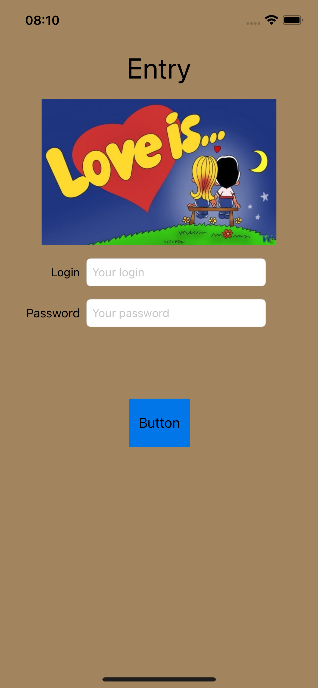
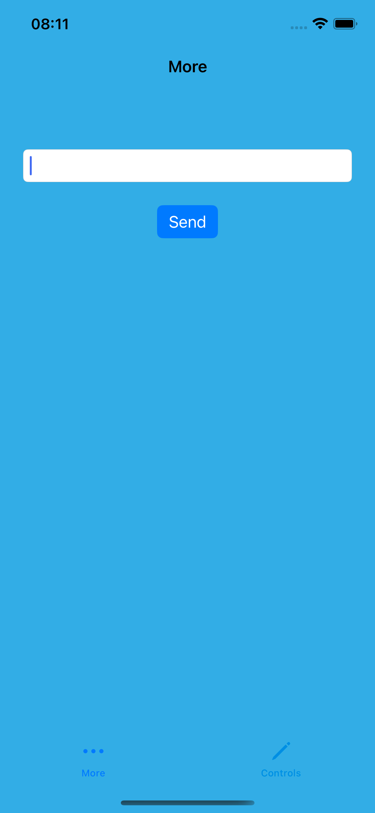
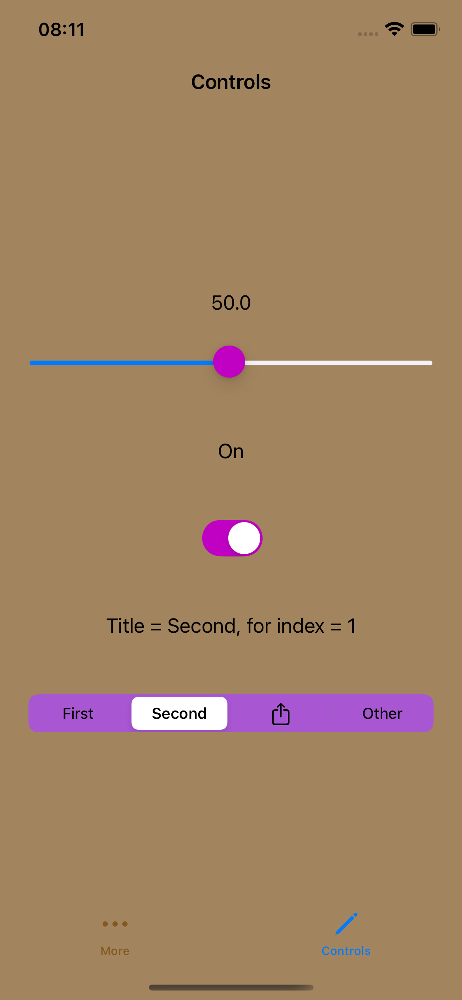

# AutoLayoutApp

Приложение для демонстрации работы с элементами управления в iOS, такими как слайдеры, переключатели, сегментированные контролы, а также экран входа и таб-бар.

## Описание

Это приложение включает несколько экранов, каждый из которых демонстрирует работу с различными элементами управления:

- **UISlider**: позволяет пользователю изменять значение с помощью слайдера.
- **UISwitch**: переключатель для включения/выключения.
- **UISegmentedControl**: контрол с несколькими сегментами, где можно выбрать один вариант.
- **LoginViewController**: экран для ввода логина и пароля с проверкой данных.
- **DetailViewController**: экран, отображающий подробную информацию, переданную через свойство `detailText`.
- **MoreViewController**: экран, где пользователь может ввести текст и передать его на новый экран.
- **TabBarViewController**: контроллер с табами, который при первом запуске показывает экран входа.

## Технологии

- **Swift**
- **UIKit**
- **Xcode**

## Возможности

- Работа с элементами управления: слайдеры, переключатели, сегментированные контролы.
- Переход между экранами с передачей данных.
- Авторизация с проверкой логина и пароля.
- Управление табами с логикой отображения экрана входа при первом запуске.
- Простая визуализация данных и событий на экранах с использованием Auto Layout.

## Скриншоты

## Установка

1.	Склонируйте репозиторий:
   
git clone https://github.com/DanilaRuzh/AutoLayoutApp.git

2. Откройте проект в Xcode
3. Запустите на симуляторе или устройстве

## Контакты

Автор: DanilaRuzh GitHub: https://github.com/DanilaRuzh
